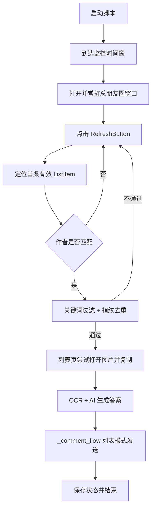

# 总朋友圈刷新监听模式说明

## 1. 适用场景

你用小号只关注目标人时，建议用这个模式：

1. 常驻在“总朋友圈”窗口。
2. 每轮先点刷新按钮。
3. 只处理首条命中目标作者的内容。

---

## 2. 启动命令

```powershell
python examples/run_feed_refresh_listener.py <发布时间HH:MM> <目标作者> [轮询秒数]
```

示例：

```powershell
python examples/run_feed_refresh_listener.py 19:15 孙大炮
python examples/run_feed_refresh_listener.py 19:15 孙大炮 0.5
```

轮询秒数规则：

1. 默认 `0.5`
2. 下限 `0.3`

窗口行为：

1. 当前默认最大化（`is_maximize=True`）
2. 若你改为非最大化，请固定窗口尺寸后再调 offset

---

## 3. 执行链路



---

## 4. 评论点击方式

评论入口流程：

1. 基于当前内容项右下角偏移点击“省略号”。
2. 点出 `CommentButton` 后进入输入框。
3. 粘贴文本后按发送锚点偏移点击发送。

这套逻辑和 `Moments.like_posts` 的“先点省略号再评论”是同一思路，不是直接控件树定位“评论区坐标”。

---

## 5. 当前限制

1. 命中后默认不进详情页，完全在列表页处理。
2. 图片提取失败时本轮直接跳过，不走截图兜底。
3. 发送成功判断是流程级，不是微信端强校验。
