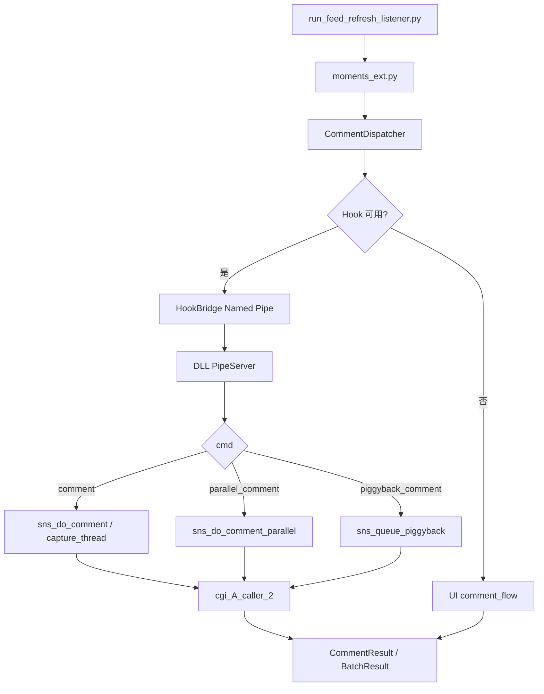
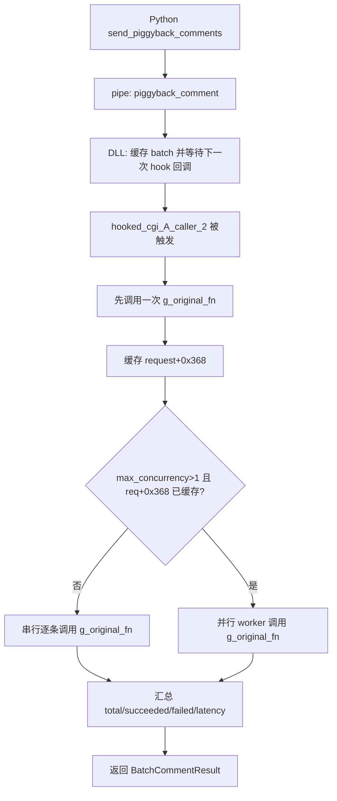

# Hook 评论链路流程图（代码对齐版）

> 更新时间：2026-02-10（按最新代码扫描）
> 对应代码：`pyweixin/moments_ext.py`、`pyweixin/comment_dispatcher.py`、`pyweixin/hook_bridge.py`、`hook/src/pipe_server.cpp`、`hook/src/sns_comment.cpp`

## 1. 端到端主链路

## 2. `piggyback_comment` 执行分支（当前关键）

## 3. 现状速记

1. `pipe_thread` 仍有 `0xC0000005` 风险。
2. `capture_thread` 可用，但依赖回调触发时机。
3. piggyback 已有 10/10 成功样本，已验证耗时为 `5591ms / 10 条`。
4. 代码内已有 piggyback 并行分支，但稳定收益仍待验收。
5. 目标差距：还需把总耗时从 `5591ms` 压到 `<1000ms`（还差 `4591ms`）。
