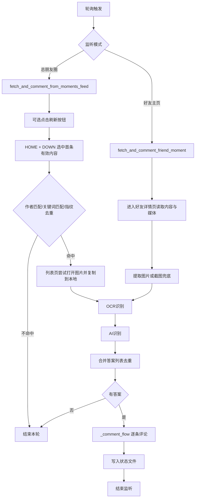

# 朋友圈自动抢答实现说明（当前版）

## 1. 目标与范围

当前实现覆盖两条主流程：

1. `start_test.py`：监听“某个好友主页”的首条朋友圈，命中后识别并评论。
2. `examples/run_feed_refresh_listener.py`：监听“总朋友圈”首条内容，先点刷新，再按作者筛选，命中后识别并评论。

重点结论：

1. 总朋友圈监听流程**不打开详情页**，直接在列表页完成图片提取 + 评论发送。
2. 评论入口不是 `RefreshButton`，而是“内容项右下角省略号 -> 评论按钮 -> 输入并发送”。

---

## 2. 入口与核心函数

### 2.1 入口脚本

1. `start_test.py`
2. `examples/run_feed_refresh_listener.py`

### 2.2 核心能力函数

1. `pyweixin/WeChatAuto.py` `Moments.fetch_and_comment_friend_moment(...)`
2. `pyweixin/WeChatAuto.py` `Moments.fetch_and_comment_from_moments_feed(...)`
3. `pyweixin/WeChatAuto.py` `Moments._comment_flow(...)`
4. `pyweixin/WeChatAuto.py` `Moments._open_comment_editor(...)`
5. `pyweixin/WeChatAuto.py` `Moments._paste_and_send_comment(...)`

---

## 3. 总体流程图

---

## 4. 评论点击与发送（真实实现）

### 4.1 点开评论框

统一走 `Moments._open_comment_editor(...)`：

1. 以当前内容项 `content_item.rectangle()` 作为基准。
2. 计算省略号点击坐标：`(rect.right - x_offset, rect.bottom - _SNS_ELLIPSIS_Y_OFFSET)`。
3. 点击省略号后检查 `CommentButton` 是否出现。
4. 出现则点击评论按钮进入输入框；失败重试（`_SNS_CLICK_RETRY`）。

`x_offset` 来源：

1. 默认 `_SNS_ELLIPSIS_X_OFFSET`。
2. 在详情页偏移模式 `use_offset_fix=True` 时，额外叠加窗口左边距修正。

### 4.2 发送评论

统一走 `Moments._paste_and_send_comment(...)`：

1. 可选清空输入框（`Ctrl+A` + `Backspace`）。
2. 把文本写到系统剪贴板后 `Ctrl+V` 粘贴。
3. 若有发送锚点 `anchor_source`：
   - 列表模式：按 `_SNS_SEND_LIST_*` 偏移定位发送按钮区域。
   - 详情模式：按 `_SNS_SEND_DETAIL_*` 偏移定位发送按钮区域。
   - 两种模式都先走绿色像素识别定位“发送”按钮，失败再回退到偏移坐标点击。
4. 无锚点时回退 `Enter` 发送。

### 4.3 坐标参数外置（推荐）

你可以不改源码，直接用本地配置覆盖偏移量：

1. 复制 `config/sns_click_offsets.example.json`
2. 新建 `config/sns_click_offsets.local.json`
3. 按你机器实测修改 offset 数值
4. 默认值已贴近作者实现：省略号 `(44,15)`，发送按钮 `(70,42)`

读取优先级：

1. 环境变量 `PYWEIXIN_SNS_OFFSET_FILE` 指向的文件
2. `config/sns_click_offsets.local.json`
3. `config/sns_click_offsets.json`
4. 否则使用代码内默认值

---

## 5. 总朋友圈监听实现（当前重点）

函数：`Moments.fetch_and_comment_from_moments_feed(...)`

执行顺序：

1. 复用外部传入的 `moments_window`（常驻窗口），没有则新开。
2. 尝试回退到列表页（若当前不在列表页）。
3. `refresh_first=True` 时点击 `Buttons.RefreshButton`。
4. 在 `MomentsList` 中 `HOME` 后逐次 `DOWN`，选择第一个有效内容项。
5. 解析作者、内容、图片数、发布时间，计算指纹（content + publish_time + image_count）。
6. 依次做作者筛选、关键词筛选、指纹去重。
7. 命中后在**列表页**尝试打开图片查看器并右键复制图片，保存到本地目录。
8. 回调 `ai_callback(content, image_paths)` 产出答案（支持 `str` 或 `list[str]`）。
9. 使用 `_comment_flow(..., anchor_mode='list')` 逐条评论。

注意：

1. 若图片帖但列表页没提取到图片，当前策略是本轮跳过（不走截图兜底）。
2. 示例脚本里评论后会保持朋友圈窗口不关闭，便于你现场观察发送状态。

---

## 6. OCR + AI 策略（当前）

入口脚本中 `ai_callback` 逻辑：

1. 先 OCR：从题干提取引号关键词，对每张图统计出现次数。
2. 再 AI：调用 `ArkChatProvider` 做多模态答案提取。
3. 合并去重，得到 `answers: list[str]`，逐条发送评论。

OCR提供者：

1. `pyweixin/rush_ai.py` `PaddleOCRProvider`
2. 已兼容新旧 PaddleOCR 初始化参数（`device/use_angle_cls/use_textline_orientation`）

当前环境兼容性提示：

1. 你的 `.venv` 是 Python `3.14`。
2. 已安装 `paddleocr/paddlex`，但 `paddlepaddle` 在该环境不可用，OCR会自动降级为禁用。
3. 脚本仍可运行 AI-only 流程。

---

## 7. 轮询与状态管理

### 7.1 轮询间隔

1. `start_test.py` 默认 `1.0s`。
2. `examples/run_feed_refresh_listener.py` 默认 `0.5s`，最小限制 `0.2s`。

### 7.3 窗口最大化

当前这两条抢答主流程都支持不最大化运行：

1. `start_test.py` 当前默认 `is_maximize=True`（更稳）
2. `run_feed_refresh_listener.py` 当前默认 `is_maximize=True`（更稳）

### 7.2 状态文件

1. 好友模式：`rush_state_test_<好友>.json`
2. 总朋友圈模式：`rush_state_feed_<作者>.json`

关键字段：

1. `last_fingerprint`
2. `commented`
3. `comment_text`
4. `comment_time`

---

## 8. 已知风险与建议

1. 评论发送仍依赖坐标偏移，分辨率/缩放/微信UI变化会影响点击精度。
2. `comment_posted=True` 代表“发送流程已执行”，不代表微信侧强校验成功。
3. 总朋友圈模式对图片提取失败较敏感，当前不会走截图兜底。
4. 若必须启用本地OCR，建议改用 Python 3.10/3.11 环境单独建虚拟环境。
