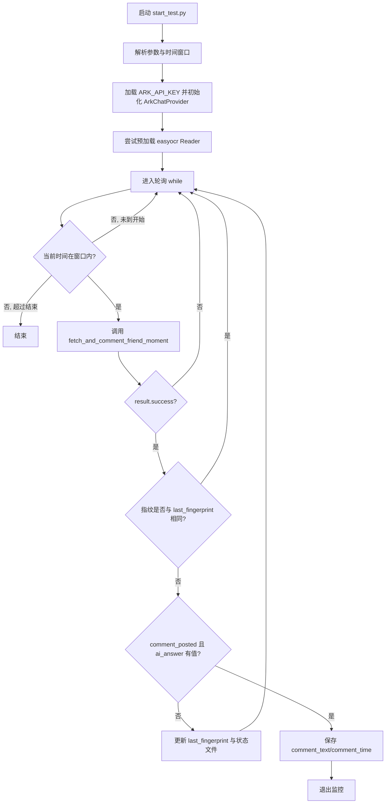
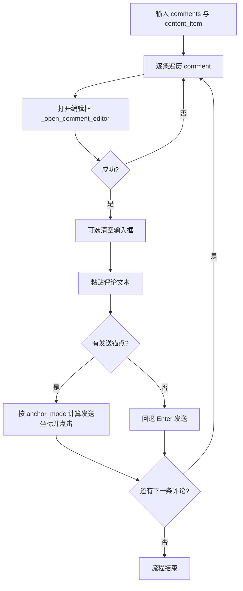

# 朋友圈自动抢答系统 - 实现文档（最新版）

## 概述

基于 `pyweixin` 的微信 4.0 UI 自动化能力，实现“定时监控 -> 读取朋友圈 -> OCR+AI 识别 -> 自动评论发送”的闭环流程。

当前版本的关键变化：

1. 评论点击与发送逻辑已统一为公共管线（`_comment_flow`）。
2. 识别端支持 OCR 与 AI 双通道，允许返回多条答案并逐条发送评论。

---

## 入口与用法

入口脚本：`start_test.py`

```bash
python start_test.py <发布时间> [好友备注]
# 示例1：python start_test.py 4:00
# 示例2：python start_test.py 4:00 孙大炮
```

参数说明：

1. `发布时间`：如 `1:52` / `13:45`
2. `好友备注`：可选，不传默认 `"小蔡"`

---

## 总体流程图



---

## 分阶段实现

## 阶段 1：定时轮询与状态机（`start_test.py`）

核心行为：

1. 计算监控时间窗口：`发布前 2 分钟` 到 `发布后 5 分钟`
2. 每 1 秒轮询一次
3. 调用 `Moments.fetch_and_comment_friend_moment(...)`
4. 用 `fingerprint` 去重（避免同一条帖子重复处理）
5. 命中评论发送条件时写入 `rush_state_test_*.json` 并退出

状态文件记录的关键字段：

1. `last_fingerprint`
2. `commented`
3. `comment_text`
4. `comment_time`
5. `last_content`
6. `last_time`

---

## 阶段 2：朋友圈读取与过滤（`fetch_and_comment_friend_moment`）

函数：`pyweixin/WeChatAuto.py` 中 `Moments.fetch_and_comment_friend_moment(...)`

步骤：

1. 打开好友朋友圈并最大化窗口
2. 在 `MomentsList` 中定位首条可操作朋友圈（跳过 `AlbumBaseCell` / `AlbumTopCell`）
3. 从 `SnsDetailList` 首个条目提取 `content`、`publish_time`、`image_count`
4. 生成指纹（`content + publish_time + image_count` 的 SHA1）
5. 执行关键词过滤（`include_keywords` / `exclude_keywords`）
6. 过滤通过后才进入媒体提取与识别流程

关键词过滤策略：

1. `include_keywords` 存在时，必须至少命中一个
2. `exclude_keywords` 存在时，命中任意一个即跳过

---

## 阶段 3：媒体提取（高清优先，截图兜底）

策略：

1. 如果识别到有图片，先尝试进入大图模式逐张右键复制，保存高清 PNG
2. 高清提取失败或无图时，回退 `detail_item.capture_as_image()` 截图

这样做的原因：

1. 计数类题目对清晰度敏感，高清图通常比 UI 截图更稳定

---

## 阶段 4：识别（OCR + AI 双通道）

位置：

1. 编排逻辑：`start_test.py` 中 `ai_callback`
2. AI provider：`pyweixin/rush_ai.py` 中 `ArkChatProvider`

执行方式：

1. 先尝试 OCR 计数（提取引号关键词并计数）
2. 再调用 ArkChatProvider 做多模态识别
3. 合并答案并去重，返回 `answers: list[str]` 或 `None`

`fetch_and_comment_friend_moment` 对识别结果做统一：

1. `str` -> `[str]`
2. `list[str]` -> 清洗后列表
3. 空结果 -> 跳过评论

---

## 阶段 5：统一评论发送管线（最新核心）

评论不再由各函数各写一套，统一调用：

1. `_open_comment_editor(...)`
2. `_paste_and_send_comment(...)`
3. `_comment_flow(...)`

坐标参数集中在模块常量：

1. `_SNS_ELLIPSIS_X_OFFSET = 40`
2. `_SNS_ELLIPSIS_Y_OFFSET = 15`
3. `_SNS_SEND_LIST_X_OFFSET = 70`
4. `_SNS_SEND_LIST_Y_OFFSET = 50`
5. `_SNS_SEND_DETAIL_X_OFFSET = 60`
6. `_SNS_SEND_DETAIL_Y_OFFSET = 82`
7. `_SNS_CLICK_RETRY = 2`

### 点开评论区与发送（当前真实实现）

1. 不是通过 `child_window(...RefreshButton)` 这种控件直接找“评论区”入口。
2. 当前是先算坐标点“省略号”：
   - 基于当前内容条目 `content_item.rectangle()`
   - 用 `_SNS_ELLIPSIS_X_OFFSET`、`_SNS_ELLIPSIS_Y_OFFSET` 算出 `ellipsis_area`
   - `mouse.click(coords=ellipsis_area)`
3. 省略号展开后，再找并点击 `CommentButton` 打开输入框（失败会重试，最多 `_SNS_CLICK_RETRY` 次）。
4. 发送阶段先粘贴（剪贴板 + `Ctrl+V`），再按锚点算“发送”坐标点击：
   - 列表模式：`anchor_mode='list'`
   - 详情模式：`anchor_mode='detail'`
5. 没有锚点时，回退 `Enter` 发送。

这一套都在：

1. `_open_comment_editor(...)`
2. `_paste_and_send_comment(...)`
3. `_comment_flow(...)`

### 评论子流程图



---

## 业务函数与评论管线接入关系

1. `like_posts(...)`：列表页锚点模式（`anchor_mode='list'`）
2. `like_friend_posts(...)`：列表页锚点模式（`anchor_mode='list'`，带鼠标预移动）
3. `fetch_and_comment_friend_moment(...)`：详情页锚点模式（`anchor_mode='detail'`，`use_offset_fix=True`）
4. `comment_friend_moment(...)`：详情页锚点模式（`anchor_mode='detail'`）

注意：旧文档中的 `comment_latest_friend_moment` 已更新为 `comment_friend_moment`。

---

## 与“按下键逐个选中”描述的对应关系

作者描述的“窗口放大 + 按下键逐个选中 + 按相对位置点评论”在当前代码中是部分一致的：

1. `like_posts(...)`：一致  
   - `moments_window` 打开后，`moments_list.type_keys('{HOME}')`
   - 进入循环后持续 `type_keys('{DOWN}')` 逐条选中，再对当前选中项执行点赞/评论
2. `fetch_and_comment_friend_moment(...)`：相似但更收敛  
   - 先 `PGDN + PGUP` 刷新视图
   - 再最多 6 次 `DOWN` 找首条有效内容并进入详情页
   - 评论在详情页里走 `anchor_mode='detail'`，不是无限向下遍历全列表

---

## `fetch_and_comment_friend_moment` 返回结构

```python
{
  "success": bool,
  "content": str,
  "image_count": int,
  "publish_time": str,
  "fingerprint": str,
  "ai_answer": str | list[str] | None,
  "comment_posted": bool,
  "error": str | None,
  "image_paths": list[str],
  "screenshot_path": str,
  "detail_folder": str
}
```

语义说明：

1. `success=True` 表示抓取流程成功完成，不等价于“评论一定发送成功”
2. `comment_posted=True` 当前表示“评论流程已执行”，未做强校验的二次确认

---

## 已知限制

1. 评论入口与发送按钮依然含坐标点击，分辨率/缩放变化可能影响稳定性。
2. 发送成功判定目前偏弱，缺少强一致校验（例如评论区回读确认）。
3. 详情页锚点兜底策略在极端 UI 结构变化下可能误选最后一个 ListItem。
4. OCR 识别准确率受图片质量、字体、遮挡影响；AI 速度与准确率受模型参数影响。

---

## 涉及文件

| 文件 | 作用 |
|------|------|
| `start_test.py` | 主入口：轮询、状态保存、OCR+AI 回调编排 |
| `pyweixin/WeChatAuto.py` | 朋友圈抓取、统一评论流程、自动发送 |
| `pyweixin/WeChatTools.py` | 打开微信窗口与朋友圈导航 |
| `pyweixin/Uielements.py` | UI 元素定位定义（按钮、列表、输入框等） |
| `pyweixin/rush_ai.py` | ArkChatProvider（多模态识别） |
| `config/.local_secrets.json` | ARK_API_KEY 配置 |
